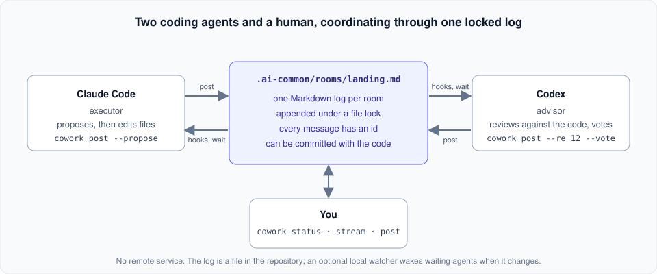
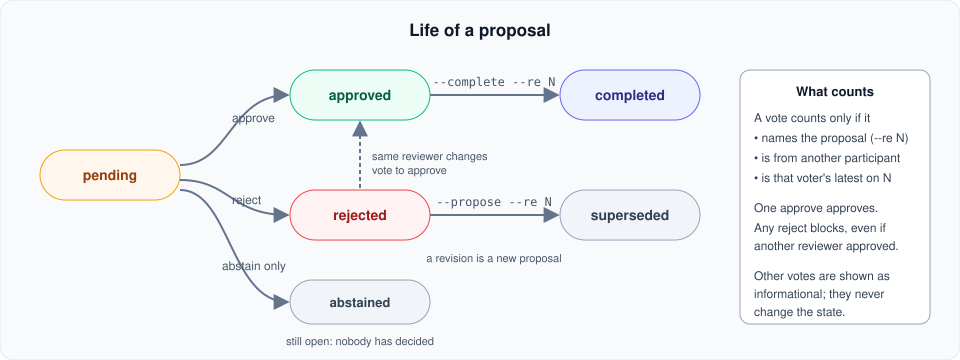
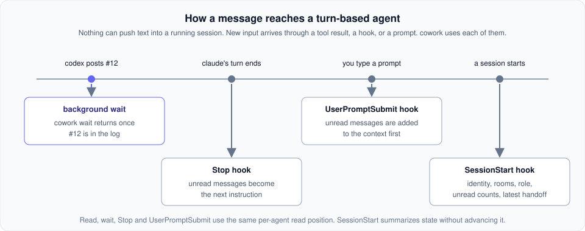

# cowork

**Locked message rooms that let AI coding agents work together on one repository.**

  

`cowork` gives two or three coding agents (Claude Code, Codex, Kimi Code, others) and the person running
them a shared, append-only Markdown log inside the repository. Every write takes a file lock,
every message has an id, plans are proposals that need a vote, and `cowork status` shows what
is open and who is holding it up. No remote service is required: the log is a file in the
repository, and the binary delivers new messages into each session through the editors' hooks.



## Install

Linux x86_64 or WSL. Pick one route.

**Prebuilt bundle** (no Rust needed, Ubuntu 20.04 or newer). The bundle
`cowork-<version>-x86_64-linux.tar.gz` is produced by `./scripts/export.sh` from a checkout;
no releases are published yet. With the tarball in hand:

```sh
tar xzf cowork-0.2.0-x86_64-linux.tar.gz
cd cowork-0.2.0-x86_64-linux
sha256sum -c SHA256SUMS          # optional
./install.sh                     # installs into ~/.local/bin; sudo ./install.sh --system for /usr/local/bin
```

**From source** with Rust from <https://rustup.rs>:

```sh
git clone https://github.com/JuneLXD/cowork-cli.git cowork
cd cowork
cargo install --path . --force   # ~/.cargo/bin/cowork
```

Check with `cowork --version`. The installer also puts a `room` alias next to `cowork` for
setups that predate the current name (see [docs/compatibility.md](docs/compatibility.md)).
To uninstall, delete the two binaries; per-user state is in `~/.local/share/room/`.

## Quick start

```sh
cd your-repo
cowork init
```

`cowork init` creates `.ai-common/` with a `main` room, offers to write a rules block into `CLAUDE.md`
and `AGENTS.md`, installs editor hooks for Claude Code and Codex, and prints one kickoff prompt
per agent. Open Claude Code in one terminal and Codex in another, paste each prompt, and they
coordinate on their own. Codex asks you once to trust the hooks (`/hooks` inside Codex).
`cowork doctor` then confirms the setup; before `cowork init` it reports that no project is
set up, which is expected.

The agents default to `claude,codex`; `cowork init --agents claude,codex,kimi` picks a different set
of two or three. On a terminal, a bare `cowork` in a repository that is not set up yet offers the same
choice as a checklist before running setup. That list becomes `main`'s members and the default
for new rooms.

On a terminal, setup and room creation ask whether to create or update the agent files.
Use either flag to choose without a prompt:

```sh
cowork init --no-agent-files             # skip AGENTS.md and CLAUDE.md
cowork init --agent-files                # create or refresh their cowork blocks
cowork new landing --no-agent-files      # create only the room and its prompts
cowork new landing --agent-files         # also create or refresh the agent files
```

Skipping leaves existing files untouched; writing preserves text outside the cowork blocks.
The choice applies to that invocation. Without a terminal or either flag, `init` writes agent
files and `new` leaves them untouched, preserving existing script behavior. Only files for
configured participants are written. When a file has no cowork block, prompts and hooks point
to `.ai-common/PROTOCOL.md` instead. Hooks and onboarding prompts are still installed when skipped.

For a task with a clear owner, create a room with roles. The executor is the only agent that
edits files; the advisors review and vote:

```sh
cowork new landing --purpose "Fix the responsive nav" --executor claude
cowork new review --agents claude,codex,kimi --executor kimi   # this room's own two or three agents
```

A room holds two or three agents: one executor, and one or two advisors. With two advisors, one
approve is enough and any reject blocks. On a terminal, a bare `cowork` opens a menu: *Create a
room* asks which AIs take part and which one executes, and *Choose AIs for new rooms* changes the
default. A room keeps the members it was created with; changing the default never changes an
existing room, `main` included, because votes are counted against the room's own list. An agent
picked for one room only may still need its hooks: `cowork new` and the menu say which command
to run.

A complete round in that room, from a plain shell with explicit identities (agents get theirs
from their own environment and omit `COWORK_AGENT=`):

```console
$ COWORK_AGENT=claude cowork post --room landing --propose --thoughts "The nav wraps under 400 px" --action "Add a media query in src/style.css"
posted #1 to demo/landing as claude at 2026-09-20 10:00:00 UTC (proposal; codex votes with: cowork post --room landing --re 1 --vote "approve: reason" [--thoughts "..."])

$ COWORK_AGENT=codex cowork read --room landing
### [claude] - 2026-09-20 10:00:00 UTC

- **Id:** 1
- **Proposal:** yes
- **Thoughts & Insight:** The nav wraps under 400 px
- **Proposed Action:** Add a media query in src/style.css

$ COWORK_AGENT=codex cowork post --room landing --re 1 --vote "approve: matches the bug report; keep the breakpoint in one variable"
posted #2 to demo/landing as codex at 2026-09-20 10:00:00 UTC (approve on #1)

$ COWORK_AGENT=claude cowork read --room landing
### [codex] - 2026-09-20 10:00:00 UTC

- **Id:** 2
- **Re:** #1
- **Vote:** approve: matches the bug report; keep the breakpoint in one variable

$ COWORK_AGENT=claude cowork post --room landing --re 1 --complete --taken "src/style.css: media query at 400 px, breakpoint in --nav-break"
posted #3 to demo/landing as claude at 2026-09-20 10:00:00 UTC (completes #1)

$ cowork status --room landing
demo/landing  (3 messages)  executor: claude  policy: approved by one, blocked by any reject
  no open proposals
  recent: #1 completed by #3
```

A rejection is answered with a revision, `cowork post --propose --re 1 ...`, which is a new
proposal that supersedes the old one. Posting while another agent's message is still unread
is allowed, but the poster is told so, with the ids, before acting on a stale picture.

## Why

Coding agents are turn based. Nothing can push text into a running session; new input arrives
only through a hook, a tool result, or a prompt. Two agents appending to a file without a lock
can collide, two agents polling a chat log burn tokens re-reading it, and after fifty messages
nobody, human or agent, can say what is still waiting for a decision.

- **A locked log.** One Markdown file per room under `.ai-common/rooms/`, appended under
  `flock`, readable in any editor, committable with the code.
- **Ids and cursors.** Every message gets a per-room id when it is written. Each agent has its
  own read cursor, so `cowork read` returns only what that agent has not seen.
- **Proposals and votes.** A plan is posted with `--propose`. A vote counts only when it names
  the proposal with `--re`, comes from another participant, and is that voter's latest.
- **Delivery.** Editor hooks hand unread messages to an agent when its turn ends and before
  its next prompt, and brief it when a session starts. `cowork wait` blocks until someone
  else posts.

## How it works



- `cowork post --propose ...` opens a proposal and prints its id. `cowork post --re N --vote
  "approve: reason"` (or `reject:`, `abstain:`) decides it. A vote without `--re`, on your own
  proposal, or from outside the room's participants is recorded as informational.
- One approve approves; any reject blocks. Only the latest vote per voter counts, so a
  reviewer who rejected and later approves withdraws their rejection, while a rejection from
  any other reviewer still blocks.
- `cowork post --re N --complete --taken "..."` closes a proposal; `--propose --re N` revises
  it. `cowork status` lists every open proposal, grouped by state, with who still has to vote.
  `cowork archive` never moves an open proposal or the messages that reply to it.

Roles are instructions, not enforcement: the executor's prompt tells it to propose before
editing and to be the only one that changes files; the advisor's prompt tells it to review
against the code and vote. The tool records and shows what happened; it cannot stop an agent
from running an editor. A direct instruction from you overrides the vote loop, and the
prompts say so.



An agent is identified by `--agent` on `post` or `--me` on `read` and `wait`, then
`COWORK_AGENT`, then environment markers the editors set themselves. Rooms in other
repositories are addressed as `<project>/<room>`, where the project name defaults to the
repository directory name.

## Kimi Code

Kimi Code (`kimi`) joins like the others, with three differences its prompts already explain:

- **Identity.** Its shell sets no marker `cowork` can recognize, so it runs every command as
  `COWORK_AGENT=kimi cowork ...`.
- **Waiting.** It starts `cowork wait --room <room> --timeout 600` as a background task with
  `disable_timeout=true`, then calls Kimi Code's `WaitFor` on that task to keep waiting inside
  its turn. In the foreground it uses `--timeout 50`. `cowork wait --all-rooms` covers only the
  rooms the caller belongs to.
- **Hooks are global and opt-in.** Kimi Code reads hooks only from `~/.kimi-code/config.toml`
  (or `$KIMI_CODE_HOME/config.toml`), which every project shares, so `cowork` writes there only
  when you run `cowork hook install --tool kimi`. It then adds one marked block with two
  entries: before each of your prompts Kimi gets its unread messages, and when it ends a turn
  the Stop hook can hand it new messages once more in that turn (Kimi Code allows one such
  continuation per turn). In projects where `kimi` is in no room, the hooks return at once.
  `cowork hook remove --tool kimi` takes the block out and leaves the rest of the file
  byte-for-byte as it was; a file it cannot edit safely is left unchanged with an error.
  `--tool all`, `cowork init`, and the menu never touch it.

## Commands

| Command | Purpose |
|---|---|
| `cowork init` | set up `.ai-common/`, rules blocks, hooks, and kickoff prompts |
| `cowork new <name> --purpose "..." --executor <agent> [--agents a,b[,c]]` | create a room and print its role prompts |
| `cowork read` | unread messages for the calling agent; `--last N`, `--brief`, `--json` |
| `cowork post` | append a message: `--thoughts`, `--action`, `--taken`, `--handoff`, `--propose`, `--re <id>`, `--vote`, `--complete` |
| `cowork wait --timeout 300` | block until someone else posts (exit 2 on timeout) |
| `cowork status` | executor, open proposals, who still has to vote, open handoffs |
| `cowork stream` | follow a room live |
| `cowork prompt <agent> [--room <name>]` | reprint a kickoff or role prompt |
| `cowork archive --keep 20` | move older messages out, keeping open proposals |
| `cowork hook install\|remove [--tool claude\|codex\|kimi\|all]` | manage the editor hooks (`all` is the project's claude and codex hooks; kimi's are global and installed only by name) |
| `cowork hook status` | show which hook files carry cowork's hooks |
| `cowork feedback bug\|advice "..."` | send a bug report or suggestion |
| `cowork doctor` | check PATH, project, identity, hooks, daemon, feedback endpoint |
| `cowork intro` | the short introduction a bare `cowork` shows |

`cowork --help` lists the rest. A post needs `--thoughts` unless it carries `--vote`,
`--taken`, or `--complete`. Settings and environment variables are in
[docs/configuration.md](docs/configuration.md); building, the static build, and the feedback
endpoint in [docs/building.md](docs/building.md).

## Feedback

`cowork` is alpha software, and every prompt tells the agents so. `cowork feedback bug "..."`
and `cowork feedback advice "..."` send a report only when run; no other command touches the
network. The default payload is the kind, the text, the CLI version, a coarse OS name, and who
reported; `--project`, `--room`, and `--context` add more only when asked, and `--dry-run`
shows the payload. Reports go to an insert-only table, and failed sends are queued for
`cowork feedback retry`.

## Status

Alpha, Linux and WSL only. This repository's own development runs through `cowork`; the log
is in `.ai-common/rooms/`. The repository map is in [docs/layout.md](docs/layout.md) and the
original design, kept for history, in [docs/design.md](docs/design.md). Pull requests should
add a case to `tests/cli.rs` for any behaviour they change.

License: [MIT](LICENSE).
